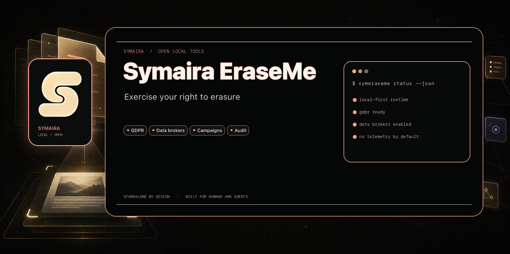

# Symaira EraseMe

[](https://github.com/danieljustus/symaira-eraseme/actions/workflows/ci.yml)
[](https://github.com/danieljustus/symaira-eraseme/releases)
[](LICENSE)
[](https://go.dev)
[](https://swift.org)



Symaira EraseMe helps you exercise your GDPR/CCPA right to erasure against
data brokers. It is a local-first, static Go CLI with a native SwiftUI macOS
app and an authenticated MCP JSON-RPC interface.

**Status:** Beta. Core planning, event tracking, deadline handling, registry
validation, inbox triage, reports, and the MCP/CLI contracts are implemented.
Some broker-specific web flows still require manual review.

## Features

- Curated registry of more than 1,200 data brokers with jurisdiction and law metadata.
- Event-sourced SQLite storage with projections and an audit trail.
- CLI commands for profile setup, planning, execution, inbox polling, triage,
  rebuttals, scheduling, reports, and manual fallback tasks.
- Web-form automation through the `symaira-browse` integration.
- Shared LLM provider layer for reply classification and rebuttal generation.
- Local MCP HTTP JSON-RPC server with 26 catalogued tools and Bearer-token auth.
- AES-256-GCM encrypted identity profile, standard Fernet encrypted database at rest, and explicit destructive-operation consent.
- Native SwiftUI dashboard for macOS. Release DMGs contain the Go MCP server.

## Install

### macOS and Linux

```bash
brew tap danieljustus/tap
brew install symeraseme
symeraseme version
```

### Windows and other platforms

Download the matching `symeraseme_<version>_<os>_<arch>` archive from the
[latest GitHub release](https://github.com/danieljustus/symaira-eraseme/releases).
The archives are static Go builds and do not require an external runtime.

### macOS GUI

The versioned `Symaira-EraseMe-<version>-macos.dmg` is attached to the same
GitHub release. The release notes state whether Developer ID signing,
notarization, and stapling were completed.

### Migration from the pre-cutover installation

The last pre-cutover implementation is preserved at the annotated Git tag
`python-final`. Existing installations should migrate their local data before
removing the old runtime:

```bash
symeraseme migrate \
  --source /path/to/old-state \
  --destination /path/to/go-state \
  --dry-run
```

The migration is explicit, creates a backup before writing, never deletes the
source, and can resume from `.migration-state.json`. See
[TROUBLESHOOTING.md](TROUBLESHOOTING.md) for the full rollback procedure.

## Quick start

```bash
# Create an encrypted local identity profile
symeraseme init-profile

# Inspect the embedded broker registry
symeraseme registry validate
symeraseme brokers list --law GDPR

# Plan, review, and dry-run a campaign
symeraseme plan create --campaign initial --max 5
symeraseme plan show --campaign initial
symeraseme execute --campaign initial --dry-run

# Track deadlines and view reports
symeraseme tick --dry-run
symeraseme generate-report
```

Destructive execution requires explicit consent. Review the plan first and use
`symeraseme grant execute --ttl 3600` for a short-lived automation token.

## MCP server

Start the local authenticated HTTP server:

```bash
symeraseme mcp
# Default: http://127.0.0.1:8000
```

Use `--host` and `--port` to change the loopback endpoint. Non-loopback binds
require `--allow-remote`. Use `--stdio` when an MCP client needs
newline-delimited JSON-RPC over standard streams.

The token is generated on startup and written with restrictive permissions to
the configured data directory (`mcp_token`). Send it on every HTTP request as:

```text
Authorization: Bearer <token>
```

Never put the token in source control, issue reports, shell history, or logs.
The complete transport and tool contract lives in
[docs/mcp-contract.md](docs/mcp-contract.md).

## Configuration and secrets

`SYMERASEME_DATA_DIR` selects the local data directory. Credentials should be
referenced through the canonical `symvault://` form or a platform secure store;
resolved values are never logged. Provider-specific configuration is consumed
by the shared Go LLM layer.

## Development

Requirements: Go 1.26.5 or newer. A full Xcode installation is required for
the macOS GUI.

```bash
# Go CLI
make build
make test
make test-race
make lint
make vet
make coverage                 # exact 75% statement gate

# macOS app
./app/SymairaEraseMe/build.sh
VERSION=0.12.1 ./scripts/package-dmg.sh
```

The coverage gate reports exact profile counts rather than rounded package
percentages. CI runs the same gate on Linux and checks the complete Go matrix.

### Registry contributions

Add a verified YAML broker entry under `registry/brokers/`, then run:

```bash
make build
./symeraseme registry validate
```

Do not fabricate endpoints or include personal data. The registry is embedded
and read by the Go loader; it is not rewritten by normal CLI operation.

### Project layout

```text
cmd/symeraseme/       CLI entrypoint and command surface
internal/              Go domain packages and MCP handlers
registry/              Embedded broker/law/schema data
skills/                Agent skill bundle and workflow documentation
app/SymairaEraseMe/   SwiftUI macOS client
scripts/              Release and packaging scripts
.goreleaser.yml       Static archive build matrix
```

## Releases

Tags matching `v*` trigger [.github/workflows/release.yml](.github/workflows/release.yml):

1. GoReleaser builds Linux, macOS, and Windows archives for amd64 and arm64
   and creates the GitHub release.
2. The macOS job builds the SwiftUI app and uploads the versioned DMG to that
   release. Signing/notarization status is recorded explicitly.
3. The Homebrew publisher downloads the exact release archives, verifies their
   checksums, and updates `danieljustus/homebrew-tap/Formula/symeraseme.rb`.

The legacy package publisher is no longer tag-triggered. The archived tag
`python-final` remains available for historical recovery; new distribution
work is binary-first.

## Documentation

- [Contributing](CONTRIBUTING.md)
- [Troubleshooting](TROUBLESHOOTING.md)
- [MCP contract](docs/mcp-contract.md)
- [Event-store contract](docs/event-store.md)
- [Registry contract](docs/registry-contract.md)
- [Go test classification](docs/go-test-port-classification.md)
- [Agent skill bundle](skills/SKILL.md)

## License

Apache-2.0 — see [LICENSE](LICENSE).
