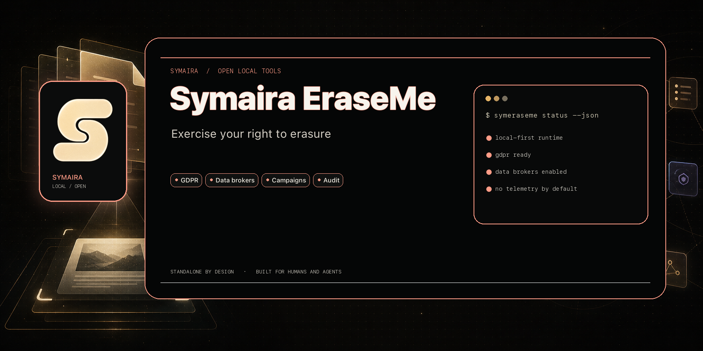

# Symaira EraseMe

> **Accepted product direction — implementation pending:** EraseMe remains an independent privacy product. Browse/Operate becoming optional Brain modules and credential UI moving to Brain must not introduce a mandatory Brain dependency into privacy workflows. See [PB-2026-09-09](docs/product-boundaries.md).

[](https://github.com/danieljustus/symaira-eraseme/actions/workflows/ci.yml)
[](https://github.com/danieljustus/symaira-eraseme/releases)
[](LICENSE)
[](https://www.rust-lang.org)
[](https://swift.org)



Symaira EraseMe helps you exercise your GDPR/CCPA right to erasure against
data brokers. It is a local-first Rust CLI with a native SwiftUI macOS app and
an authenticated MCP JSON-RPC interface.

**Current source tree:** Rust-only CLI and native SwiftUI macOS app candidate.
This Rust-only package layout is not yet a published release. The published
`v0.13.0` prerelease remains dual-backend, and `v0.12.1` is the latest stable
release. The Go implementation remains temporarily as a development oracle for
conformance checks until the separate CUT-005 retirement.

**Status:** Beta. Core planning, event tracking, deadline handling, registry
validation, inbox triage, reports, and the MCP/CLI contracts are implemented.
Some broker-specific web flows still require manual review.

## Features

- Curated registry of more than 1,200 data brokers with jurisdiction and law metadata.
- Event-sourced SQLite storage with projections and an audit trail.
- CLI commands for profile setup, planning, execution, inbox polling, triage,
  rebuttals, scheduling, reports, and manual fallback tasks.
- Explicit web-form previews and durable manual fallback tasks; browser execution
  is an injected boundary and is not a compile-time dependency.
- Shared Rust LLM provider layer for reply classification and rebuttal generation.
- Local MCP HTTP JSON-RPC server with 26 catalogued tools and Bearer-token auth.
- AES-256-GCM encrypted identity profile, standard Fernet encrypted database at rest, and explicit destructive-operation consent.
- Native SwiftUI dashboard for macOS. The unreleased Rust-only candidate DMG stages the Rust CLI/MCP server.

## Install

### macOS and Linux

```bash
brew tap danieljustus/tap
brew install symeraseme
symeraseme version
```

### Windows and other platforms

Download the archive for the published version you choose from
[GitHub releases](https://github.com/danieljustus/symaira-eraseme/releases).
The published `v0.13.0` prerelease is dual-backend; `v0.12.1` is the latest
stable release. The Rust-only archive layout describes the unreleased candidate
in this source tree, not an available release asset. Previously published
`v0.13.0` assets are immutable. Canary builds reach Homebrew only after they
are promoted to a stable release.

### macOS GUI

The current source checkout's versioned `Symaira-EraseMe-<version>-macos.dmg`
build stages the Rust CLI/MCP server for the unreleased candidate. This does not
change the already-published `v0.13.0` assets. Release notes identify whether
Developer ID signing, notarization, and stapling were completed. No GUI
Homebrew cask is configured; install the macOS app from its DMG.

### Migration from the pre-cutover installation

The last pre-cutover implementation is preserved at the annotated Git tag
`python-final`. Existing installations should migrate their local data before
removing the old runtime:

```bash
symeraseme migrate \
  --source /path/to/old-state \
  --destination /path/to/rust-state \
  --dry-run
```

The migration is explicit, creates a backup before writing, never deletes the
source, and can resume from `.migration-state.json`. See
[TROUBLESHOOTING.md](TROUBLESHOOTING.md) for the full rollback procedure.

## Quick start

```bash
# Create an encrypted local identity profile
symeraseme init-profile

# Inspect the embedded broker registry
symeraseme registry validate
symeraseme brokers list --law GDPR

# Plan, review, and dry-run a campaign
symeraseme plan create --campaign initial --max 5
symeraseme plan show --campaign initial
symeraseme plan execute --campaign initial --dry-run

# Track deadlines and view reports
symeraseme tick --dry-run
symeraseme generate-report
```

Destructive execution requires explicit consent. Review the plan first and use
`symeraseme grant execute --ttl 3600` for a short-lived automation token.

## MCP server

Start the local authenticated HTTP server:

```bash
symeraseme mcp
# Default: http://127.0.0.1:8000
```

Use `--host` and `--port` to change the loopback endpoint. Non-loopback binds
require `--allow-remote`. Use `--stdio` when an MCP client needs
newline-delimited JSON-RPC over standard streams.

The token is generated on startup and written with restrictive permissions to
the configured data directory (`mcp_token`). Send it on every HTTP request as:

```text
Authorization: Bearer <token>
```

Never put the token in source control, issue reports, shell history, or logs.
The complete transport and tool contract lives in
[docs/mcp-contract.md](docs/mcp-contract.md).

## Configuration and secrets

The event store defaults to `~/.local/share/symeraseme/symeraseme.db`; it never
falls back to a temporary directory in production. Configuration precedence is
built-in defaults, `~/.config/symeraseme/config.toml` (or
`$XDG_CONFIG_HOME/symeraseme/config.toml`), the project
`.symeraseme.toml`, then environment variables. `SYMERASEME_DATA_DIR` selects
the base data directory, `SYMERASEME_DB_DIR` overrides only the database
directory, and `SYMERASEME_ENCRYPT_DB` accepts `1|true|yes|on` or
`0|false|no|off`. Invalid values fail closed. When encryption is enabled, the
SQLite file is written as a standard Fernet envelope and decrypted only into a
private temporary directory during use; switching modes is atomic.

Credentials should be referenced through the canonical `symvault://` form or a
platform secure store; resolved values are never logged. Provider-specific
configuration is consumed by the shared Rust LLM provider layer.

## Development

Requirements: Rust 1.98.0 (pinned in `rust-toolchain.toml`). Go 1.26.6 is needed
only for the temporary Go reference/oracle checks (`make go-gate` and live
`make parity-live`); it is not needed to build or run the Rust product. A full
Xcode installation is required for the macOS GUI.

```bash
# Rust CLI and frozen-observation conformance suite
make build-rust
make rust-gate
make parity

# Temporary Go reference checks (development only, not a product runtime)
make go-gate
make parity-live

# macOS app
make app-test
./app/SymairaEraseMe/build.sh

# Local development packaging example only; not a release-version claim
VERSION=0.13.0 ./scripts/package-dmg.sh
```

`make parity` uses recorded Go observations by default and does not require a
Go executable; `make parity-live` rebuilds and runs the Go oracle. `make go-gate`
is the retained Go reference quality/build gate, including its exact 75%
statement-coverage threshold. The Go implementation and tooling remain only for
development/conformance work until the separately scoped CUT-005 retirement.

### Registry contributions

Add a verified YAML broker entry under `registry/brokers/`, then run:

```bash
make build-rust
./build/rust/debug/symeraseme-rust registry validate
```

Do not fabricate endpoints or include personal data. The registry is embedded
in the Rust CLI and is not rewritten by normal CLI operation.

### Project layout

```text
crates/                 Rust CLI, core, and engine
rust-tests/parity/      Conformance suite and frozen Go observations
cmd/symeraseme/,        Temporary Go reference implementation and packages
internal/               (development oracle only until CUT-005)
registry/               Broker/law/schema source data
skills/                 Agent skill bundle and workflow documentation
app/SymairaEraseMe/      SwiftUI macOS client
scripts/                 Build, packaging, and verification tools
```

## Releases

Tags matching `v*` trigger [.github/workflows/release.yml](.github/workflows/release.yml):

1. The Rust prerelease workflow builds natively on Linux, macOS, and Windows
   for amd64 and arm64, packages six static Rust CLI archives, and verifies the
   archives, `checksums.txt` and the per-archive CycloneDX SBOMs.
2. The publish job attests build provenance for the six archives and creates
   the GitHub release as a prerelease (canary), then reads every asset back.
3. The macOS job builds the SwiftUI app with the Rust CLI/MCP server and uploads
   the versioned DMG to that release. It is signed, notarized, stapled and attested.
4. When a release is published as stable, or a canary is promoted to stable,
   the Homebrew publisher downloads the exact release archives, verifies their
   checksums, and updates `danieljustus/homebrew-tap/Formula/symeraseme.rb`.

No GUI Homebrew cask is configured; the macOS GUI is distributed as a DMG.
Previously published `v0.13.0` dual-backend prerelease assets remain unchanged;
`v0.12.1` is the latest stable release. The Rust-only source-tree candidate has
not been published, and future release assets will use its Rust-only package
layout. The historical `python-final` tag remains available for migration and
recovery.

## Documentation

- [Contributing](CONTRIBUTING.md)
- [Troubleshooting](TROUBLESHOOTING.md)
- [MCP contract](docs/mcp-contract.md)
- [Event-store contract](docs/event-store.md)
- [Registry contract](docs/registry-contract.md)
- [Historical Python test classification](docs/go-test-port-classification.md)
- [Agent skill bundle](skills/SKILL.md)

## License

Apache-2.0 — see [LICENSE](LICENSE).
